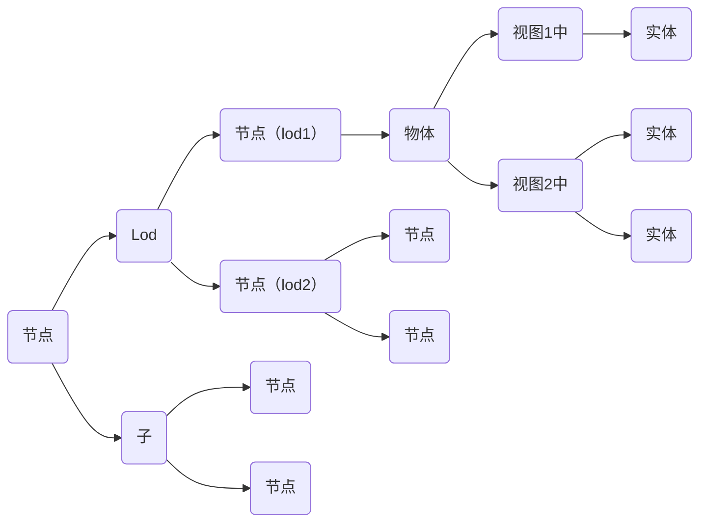

# 各概念说明
## 几何：分简单几何和复合几何，描述同一个形体
## 材质：描述材质
## 颜色：描述颜色
## 实体：组合几何和材质或颜色，复杂几何
## 物体：可由参数化构建，是可编辑对象的最小单位；构建后有多个实体组合而成，不同的视图拥有不同的实体。
## 节点：即场景中的节点，节点的末端必然应用一个物体，包含一个矩阵偏移；节点可有若干子节点；每个节点的Lod可以引用不同的物体。

# 数据结构示意

